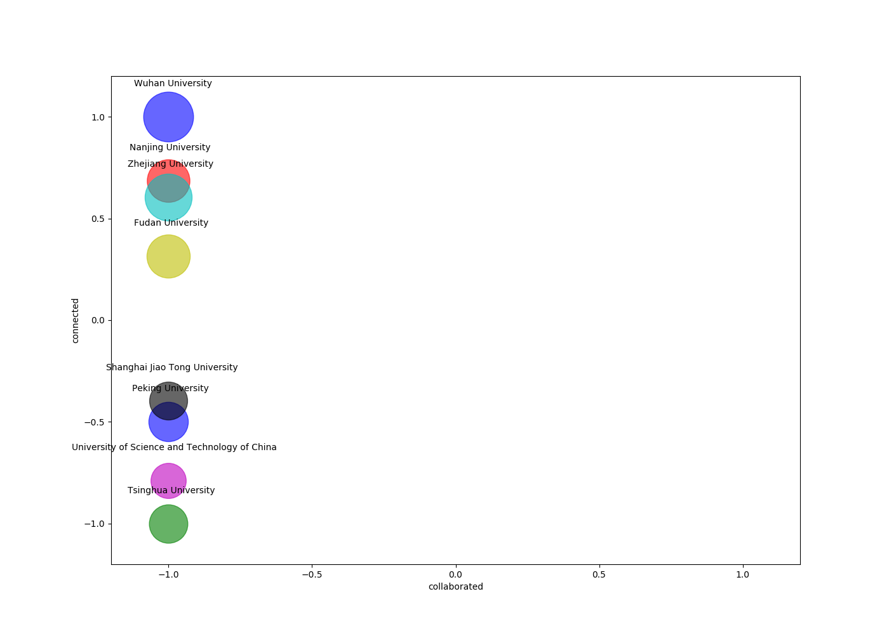

## Disclaimer
The data collected by this program comes *wholely* from public domain, i.e., institutions' official websites, Google search results, and
Google Scholar. Neither does it reflect my personal opinion nor serve as advise of any kind. The way how you interpret it
depends solely on yourself: your idea, belief, personal experiences and/or any other things that could result in a particular
attitude towards it. I modify nothing but make the data more readable and concise. There are a few issues which can produce potential
mistakes. They are discussed in the following [Known Issues](#Known-Issues) part and also noted in codes as `FIXME`. If you are suspicious of any result, please consult that part as well as codes first. Running this program *might* cause your IP address banned by Google and/or other websites' owners, whether temporarily or permanently. Before using it, you must be aware that it is all at your own risk. I am *by all means* not responsible for any direct and indirect consequences following such ban. This program comes with **ABSOLUTELY NO WARRANTY**, to the maximum extent permitted by law.

## Quick view
This is a connection figure demonstrating collected data. The x-axis shows the ratio of coauthors' affiliated institutions other than the target institution. The y-axis shows the average number of unique collaborated institution per faculty member has. The relative size of each circle represents the total times of occurrences of all different institutions with which a certain institution has collaborated with.

## Introduction
### Intuition
TODO
### Pipeline
- Acquire the faculty members' (Full Professor, Associate/Assistant Professor, and Lecturer) names of all target institutions given in [`config.json`](config.json).
- Search Google for all faculty members' names, acquire their Google Scholar homepage.
- Extract their coauthors affiliated institutions, save as a plain text file named `connections`.
- Count the numbers of occurrences of cooperated institutions of target institutions, sorted from most frequent to most rare, save it as a plain text file named `counts`.

## Usage
### Requirements
I have tested with the following config
- `requests==2.22.0`, request webpage
- `beautifulsoup4==4.6.3`, parsing HTML response
- [`pypinyin==0.33.2`](https://github.com/mozillazg/python-pinyin), converting Chinese characters to corresponding pinyin
### Command (Under development)
- The [data collection](main.py), `main.py` can accept the following parameters
```
$ python3 main.py [-h] [--range RANGE] [--crawl CRAWL] [--connection CONNECTION]
optional arguments:
    -h, --help,         show the help message and exit
    --range RANGE,      the institution(s) you want to collect connection for, e.g., if you would like to find for Tsinghua University
                        and Peking University, this should be set to their alias: 'thu pku'. Default to 'all', i.e., find for all
                        institutions supported by [institution.json](config/institution.json)
```

Then the two file described above will be generated.

### Note
- The searching and parsing process involves visiting Google websites and services. If these resources are not directly accessible from your area, you might need to come up with some way to break out of such restriction.
- Running this program takes some time and you should be careful not to crawl too harshly in case that Google bans your IP. <del>The `cooling_down` time for browsing Google Scholar sites can be set in [`main.find_connections`](main.py).</del> I have checked `robots.txt` of Google Scholar, it says that the `/citations?user=` pages can be crawled, which is exactly what we need.
- I have included a number of alternative sites for google.com. I believe in this way the crawler will be less likely to be identified as a bot when googling. So I do not perform cooling down for [`util.google_search`](util.py).

## Known Issues
### Name extracting
In [`util.extract_name`](util.py)
- By now, I simply assume that the first character in a Chinese name stands for surname, and the characters left stand for given name.
Apparently, for compound surnames, this will not work. I am considering adding rigid rules to handle this. If you have a better idea, please kindly tell me.
- This situation might be rare, but chances are that some faculty members affiliated with the same institutions have the same name, or the same pinyin representation of their names. Current code will treat them as the same person.
### Google search
In [`util.google_search`](util.py)
- The query I use is of form `[given_name] [surname] [affiliated_institution]`, and I only look for the first hyperlink to a Google scholar site in the first page of searching result. So if the link does not appear in the first page, I will assume that this faculty member does not have such a website and ignore his/her connections. I believe with such an exact query, Google will give me the link as long as it does exist.
### Institution list processing
In [`util.process_institutions`](util.py)
- This is a truly annoying part. Google Scholar does not have a standard way of demonstrating a researcher's affiliated institution. The parsed result might be just the institution's name, or mix with stopwords, the researcher's title, position and/or other information. This can result in duplicated representations of the same institution, wrong institution name or other weird behavior. I will try to tackle it with more rules and parse tools to minimize the negative effect.