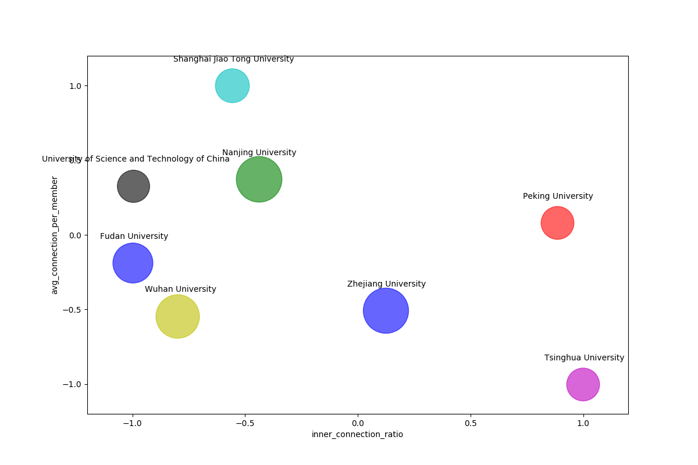

## Disclaimer
The data collected by this program comes *wholely* from public domain, i.e., institutions' official websites, Google search results, and
Google Scholar. Neither does it reflect my personal opinion nor serve as advise of any kind. The way how you interpret it
depends solely on yourself: your idea, belief, personal experiences and/or any other things that could result in a particular
attitude towards it. I modify nothing but make the data more readable and concise. There are a few issues which can produce potential
mistakes. They are discussed in the following [Known Issues](#Known-Issues) part and also noted in codes as `FIXME`. If you are suspicious of any result, please consult that part as well as codes first. Running this program *might* cause your IP address banned by Google and/or other websites' owners, whether temporarily or permanently. Before using it, you must be aware that it is all at your own risk. I am *by all means* not responsible for any direct and indirect consequences following such ban. This program comes with **ABSOLUTELY NO WARRANTY**, to the maximum extent permitted by law.

## Quick view
This is a connection figure demonstrating collected data. The x-axis shows the ratio of coauthors' affiliated institutions that are the same to the target institution. The y-axis shows the average number of unique collaborated institution per faculty member has. The relative size of each circle represents the total number of faculty members that have connections.

## Introduction
### Pipeline
- Acquire the faculty members' (Full Professor, Associate/Assistant Professor, and Lecturer, depending on different institutions,
  this could be a little different) names of all target institutions given in [`institutions.json`](config/institutions.json).
- Search Google for all these names, find their Google Scholar homepage.
- Extract their coauthors affiliated institutions, save in json format as `connections.json`.
- Count the numbers of occurrences of cooperated institutions of target institutions, sorted from most frequent to most rare, save it in json format as `counts.json`.
- Compute more statistical features with [`feature.py`](src/feature.py)
- Visualize statistical features with [`vis.py`](src/vis.py)

## Usage
### Requirements
I have tested with the following config
- `requests==2.22.0`, request webpage
- `beautifulsoup4==4.6.3`, parsing HTML response
- [`pypinyin==0.33.2`](https://github.com/mozillazg/python-pinyin), converting Chinese characters to corresponding pinyin
### Command (Initial full release)
#### Data collecting module
- `collect.py` can accept the following parameters
```
$ python3 collect.py [-h] [--range RANGE] [--crawl CRAWL] [--connection CONNECTION]

collection connections and save in json format

optional arguments:
    -h, --help,         show help message and exit
    --range RANGE,      the institution(s) you want to collect connection for,
                        e.g., if you would like to find for Tsinghua University
                        and Peking University, this should be set to their alias:
                        'thu pku'. default to 'all', i.e., find for institutions
                        supported by [institution.json](config/institutions.json)
    --crawl CRAWL       set to `True` if you want to collect connections and
                        produce connections.json file. once you have finished
                        finding and save it, you just need to load local file
                        and do not bother to crawl again. default to `False`
    --connection CONNECTION
                        the file that generated collected by this program,
                        it should be a dict of dict saved in json format 
                        (institution name -> faculty member name -> his/her connections)
                        default to `result/connections.json`
```

#### Statistics computing module
- `feature.py` can accept the following parameters
```
$ python3 analyze.py [-h] [--connection CONNECTION] [--count COUNT]
                     [--top_k TOP_K] [--min_occur MIN_OCCUR]

generate statistics and save them to a csv with collected data

optional arguments:
  -h, --help            show this help message and exit
  --connection CONNECTION
                        path to load the the connections file collected by
                        this program
  --count COUNT         path to load the the counts file collected by this
                        program, if set None, recompute the counts
  --top_k TOP_K         if recompute counts, take how many researchers a
                        faculty member connects to into account
  --min_occur MIN_OCCUR
                        if recompute counts, take only institution show up
                        more than min_occur times into account
```

#### Visualization module
- `vis.py` can accept the following parameters
```
$python3 vis.py [-h] [--stat STAT] [--plot_type PLOT_TYPE] [--fields FIELDS]
                [--area AREA]

provide visualization for statistics saved in the csv file

optional arguments:
  -h, --help            show this help message and exit
  --stat STAT           path to the csv file saved by feature.py
  --plot_type PLOT_TYPE
                        choose visualization for data, 2 for 2d plots, 3 for
                        3d ones
  --fields FIELDS       choose which fields in statistics to generate plot,
                        the order is "data_x_dim data_y_dim" for 2d plots and
                        "data_x_dim data_y_dim data_z_dim" for 3d ones
  --area AREA           choose the meaning of each dot
```  

### Note
- The searching and parsing process involves visiting Google websites and services. If these resources are not directly accessible from your area, you might need to come up with some way to break out of such restriction.
- Running this program takes some time (about 10 sec for one faculty member who has connections on google scholar) and you should be careful not to crawl too harshly in case that Google bans your IP. <del>The `cooling_down` time for browsing Google Scholar sites can be set in [`main.find_connections`](src/main.py)</del> I have checked `robots.txt` of Google Scholar, it says that the `/citations?user=` pages can be crawled, which are exactly what we need.
- I have included a number of alternative sites for google.com. I believe in this way the crawler will be less likely to be identified as a bot when googling. So I do not perform cooling down for [`util.google_search`](src/util.py).

## Known Issues
### Name extracting
In [`util.extract_name`](src/util.py)
- By now, I simply assume that the first character in a Chinese name stands for surname, and the characters left stand for given name.
Apparently, for compound surnames, this will not work. I am considering adding rigid rules to handle this. If you have a better idea, please kindly tell me.
- This situation might be rare, but chances are that more than faculty members affiliated with the same institutions have the same name, or the same pinyin representation of their names. Current code is not able to distinguish them as different persons.
### Google search
In [`util.google_search`](src/util.py)
- The query I use is of form `[given_name] [surname] [affiliated_institution]`, and I only look for the first hyperlink to a Google Scholar site in the first page of searching result. So if the link does not appear in the first page, I will assume that this faculty member does not have such website and ignore him/her. I believe with such an exact query, Google will give me the link as long as it does exist.
### Institution list processing
In [`util.process_institutions`](src/util.py)
- This is a truly annoying part. Google Scholar does not have a standard way of demonstrating a researcher's affiliated institution(s). The parsed result might be just the institution's name, or mixed with stopwords, the researcher's title, position and/or other characters. For instance, it could be simply "Nanjing University", or "Professor, Nanjing University", or even "Professor, Institute of Computer System, Nanjing University, Jiangsu, China", so on and so forth. This can result in duplicated representations of the same institution, wrong institution names or other weird behavior. I will try to tackle it with more rules and parse tools to minimize the negative effects.
